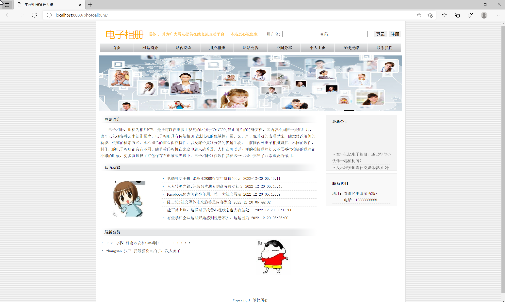
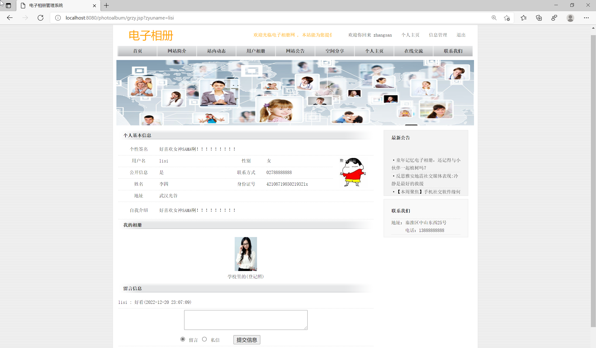
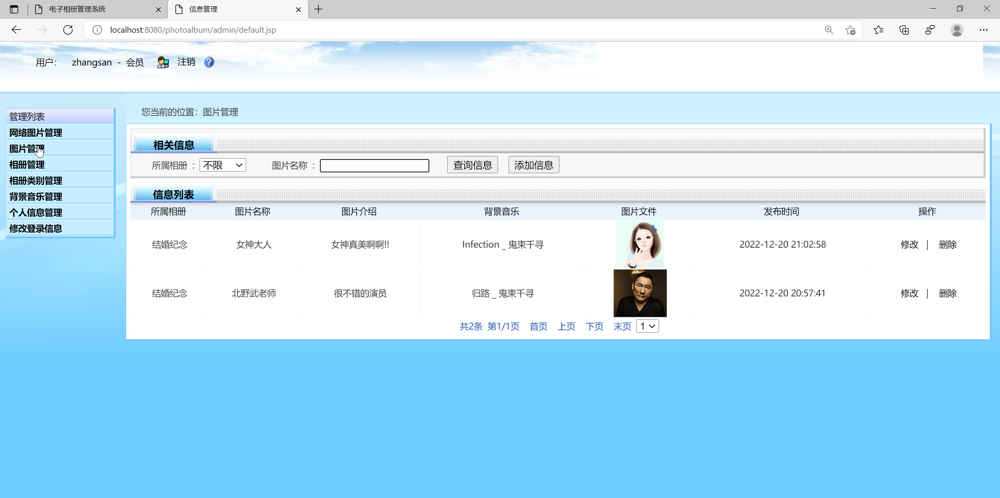
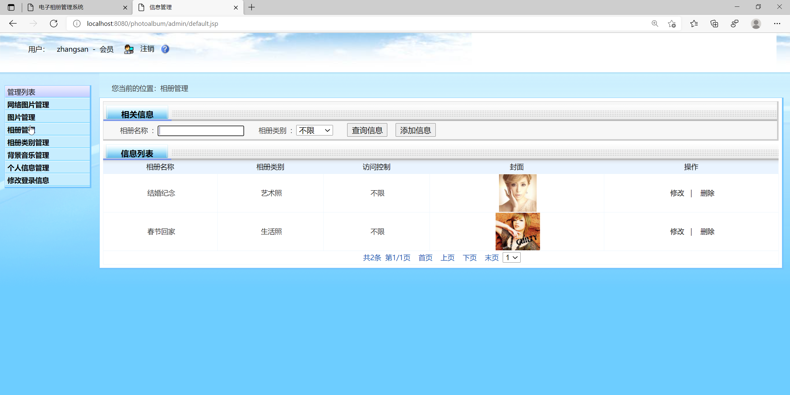

<h1 align="center">基于SSM框架的教务管理系统</h1>

 获取sql文件 QQ: 605739993 QQ群: 377586148 

<b> 需要视频演示可联系上述QQ，私发视频链接 </b>

 [个人站点: 从戎源码网](https://mzoocodes.com/)

## 简介

> 本代码来源于网络,仅供学习参考使用!
>
> 提供1.远程部署/2.修改代码/3.设计文档指导/4.框架代码讲解等服务
>
> 管理员登录地址：http://localhost:8080/photoalbum/admin/
>
> 管理员: admin 密码: admin
>
> 用户登录地址：http://localhost:8080/photoalbum/
> 
> 用户：zhangsan 密码: 123

## 项目介绍

本项目是一套基于JavaWeb的相册管理系统，该电子相册采用B/S结构，使用JAVA开发语言，结合JSP技术，以MySQL作为后台数据库。该系统包括前端用户界面和后台管理。

### 前台系统界面
主要面向终端用户，并实现用户注册，网站介绍，站场动态，用户相册，空间共享和在线交流等功能。

### 后台管理系统
主要面向系统管理员，并实现了成员管理，公告管理，网络图像管理，照片管理，相册管理，管理员信息管理和站场动态等功能。

## 环境

- <b>IntelliJ IDEA 2020.3</b>

- <b>Mysql 5.7.26</b>

- <b>Tomcat 8.0.32</b>

- <b>JDK 1.8</b>

## 运行截图

